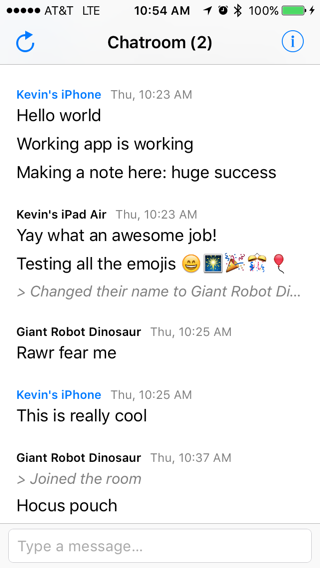

BleuChat iOS Codebase
=====================

    

BleuChat is a Bluetooth Low Energy (BLE) powered chatting app.

Setup
-----

Run `bin/setup` to install the Gem and Pod dependencies.

Development
-----------

Open `BleuChat.xcworkspace` to start developing.

Testing
-------

Press `⌘+U` to run UI and Unit tests.

Features
========

- Chat with multiple people in your area with a global chatroom
- Supports sending text and emojis
- Get notified when people join and leave the chatroom
- Delete your chat history any time
- Optimized for iPhone & iPad
- Optimized for Portrait & Landscape mode

Pipeline
--------

- Typing indicators
- Push notifications
- Sending multimedia data
- Background scanning
- Unit and UI tests

Tradeoffs
=========

Scanning
--------

Scanning and advertising is expensive yet we want it easy for users to find each other. The most expensive solution is to constantly scan for devices but that will drain the battery fast. The least expensive solution is to have the user initiate a scan but that results in a lackluster use experience. The current solution is a hybrid method conserving battery while making it easy for users to seamlessly find each other.

- On launch, starts scanning for 60 seconds
- Every minute, scans for 3 seconds
- User can manually initiate a scan for 10 seconds at any time

Sending
-------

BLE can only send/receive a limited amount of bytes at one time based on the device. Currently the app chunks a message into sending a conservative 20 bytes at a time.